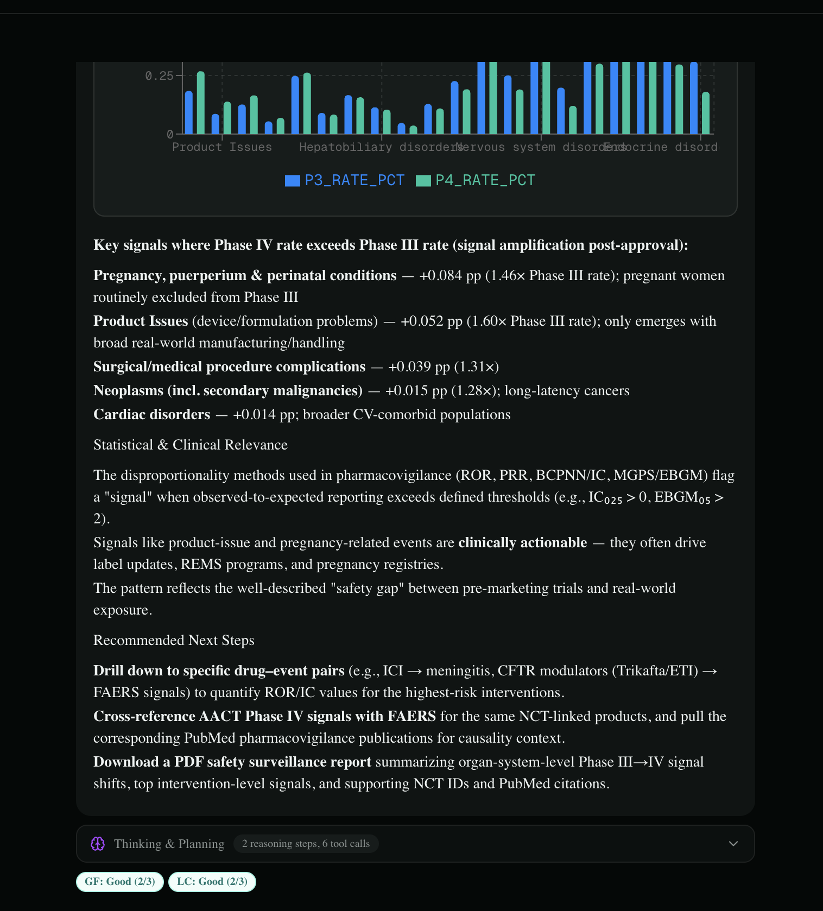
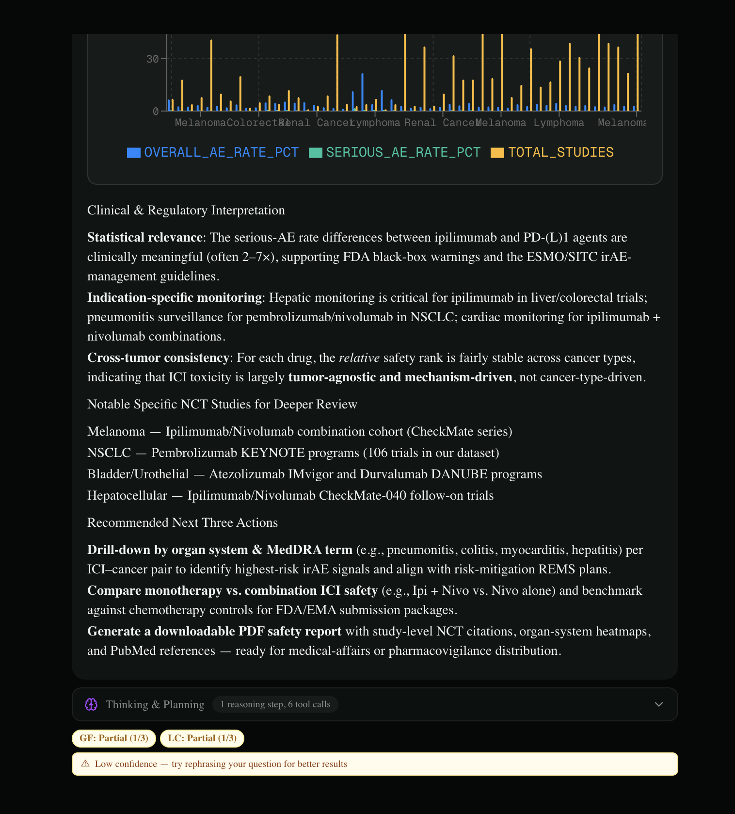
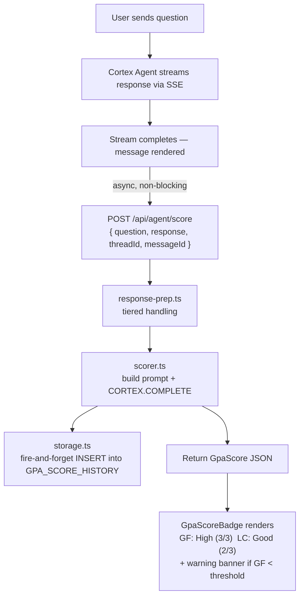

# GPA Scoring

> Real-time **LLM-as-judge** quality scoring for Snowflake Cortex AI agents.

[](https://arxiv.org/abs/2510.08847)
[](https://docs.snowflake.com/en/sql-reference/functions/complete-snowflake-cortex)
[](https://nextjs.org)
[](#design-principles)

A **reusable, agent-agnostic** module that grades every AI response the moment it
finishes streaming, shows colour-coded confidence badges inline, and persists the
scores to Snowflake for longitudinal quality tracking. Drop the folder into any
Next.js + Snowflake app and wire it up in ~30 lines.

```
GF: High (3/3)    LC: Good (2/3)
```

---

## Table of contents

- [What it does](#what-it-does)
- [How it looks](#how-it-looks)
- [How it works](#how-it-works)
- [Scoring dimensions](#scoring-dimensions)
- [Hallucination Detection (HD)](#hallucination-detection-hd)
- [Prerequisites](#prerequisites)
- [Quick start](#quick-start)
- [Configuration reference](#configuration-reference)
- [File structure](#file-structure)
- [Adding more agents](#adding-more-agents)
- [Known limitations](#known-limitations)
- [Troubleshooting](#troubleshooting)
- [Documentation](#documentation)
- [References](#references)

---

## What it does

Every AI-generated response is automatically evaluated by an LLM judge
(`claude-haiku-4-5` via `SNOWFLAKE.CORTEX.COMPLETE`) the moment streaming completes.
The judge scores the response on the **Agent GPA (Goal-Plan-Action)** dimensions,
returns a `0–3` rating with a one-sentence rationale per dimension, and the UI renders
a colour-coded badge beneath the message. Scores are written to a Snowflake history
table for dashboards and trend analysis.

Key properties:

- **Non-blocking** — scoring is fired client-side *after* the chat stream finishes, so it never delays the answer. Persistence is fire-and-forget.
- **Agent-agnostic** — the host app injects its own Snowflake query function; the module has no hard dependency on any specific agent or schema.
- **Zero UI dependencies** — the badge component uses inline styles only (no Tailwind, no shadcn).
- **Graceful degradation** — any failure (model error, unparseable JSON) silently hides the badge rather than breaking the chat.
- **Length-aware** — long responses are tiered (full / extracted / summarised) to stay within the judge's token budget.

## How it looks

**Healthy response** — green/teal badges appear beneath the answer, each with a hover tooltip showing the judge's one-sentence rationale:



**Low-confidence response** — when `GF` falls below the threshold, the badges turn amber and a warning banner nudges the user to rephrase:



A full walkthrough recording is included in the repo: [`GPA_SCORING_Video_2.mp4`](GPA_SCORING_Video_2.mp4).

## How it works



The pipeline is three pure steps on the server:

1. **`response-prep.ts`** — picks a strategy based on response length (see [tiering](#response-tiering)).
2. **`scorer.ts`** — builds a single prompt that evaluates all configured dimensions at once, calls `CORTEX.COMPLETE`, parses the JSON, clamps each score to `0–3`.
3. **`storage.ts`** — inserts the result into `GPA_SCORE_HISTORY` (self-migrating schema), never blocking the HTTP response.

### Response tiering

To keep the judge cheap and within budget, the response is preprocessed by length:

| Response length | Strategy | Extra LLM call? |
|-----------------|----------|:---:|
| ≤ `fullUpTo` (8 000) | Use full response as-is | No |
| ≤ `extractUpTo` (30 000) | Structured extraction (opening + key findings + lists + conclusion) | No |
| > `extractUpTo` | LLM summarisation down to ~3 000 chars | Yes (1 call) |

The chosen tier is recorded in the `tier` column so you can analyse it later.

## Scoring dimensions

| Key | Name | Needs extra input? | Status |
|-----|------|:---:|--------|
| **GF** | Goal Fulfillment — did it answer the question completely & accurately? | No | ✅ Implemented |
| **LC** | Logical Consistency — is the reasoning internally consistent? | No | ✅ Implemented |
| **HD** | Hallucination Detection — are claims/numbers/citations grounded, not fabricated? | No (Level 1) · tool results (Level 2) | ✅ Implemented |
| **EE** | Execution Efficiency — minimal, non-redundant steps? | Execution trace | ⚠️ Rubric defined, **trace not yet wired** |
| **PQ** | Plan Quality — was an effective plan designed? | Execution trace | ⚠️ Rubric defined, **trace not yet wired** |
| **PA** | Plan Adherence — did it follow the stated plan? | Execution trace | ⚠️ Rubric defined, **trace not yet wired** |

**GF**, **LC**, and **HD** work from the response text alone, are evaluated in a single
LLM call (~2–3 s, ~800–2 000 tokens), and are production-ready. HD becomes a stronger,
evidence-based check when you also pass the agent's tool results — see
[Hallucination Detection](#hallucination-detection-hd).

> ⚠️ **EE / PQ / PA are not functional yet.** Their rubrics exist and the storage
> columns are in place, but the scoring request carries no execution trace, so the
> judge has nothing to evaluate them against. See [Known limitations](#known-limitations).
> Keep `dimensions: ["GF", "LC", "HD"]` until trace plumbing lands.

### Score scale

| Score | Label | Colour | Meaning |
|:---:|---------|--------|---------|
| 3 | High | Green | Fully answered, no contradictions |
| 2 | Good | Teal | Mostly correct, minor omissions |
| 1 | Partial | Yellow | Incomplete, missing key components |
| 0 | Low | Red | Failed, incorrect, or refused |

When `GF < lowConfidenceThreshold` (default `2`), the badge is accompanied by an amber
"low confidence" banner suggesting the user rephrase.

## Hallucination Detection (HD)

HD flags fabricated content — invented statistics, malformed or made-up identifiers,
non-existent citations, and (most importantly) numbers that contradict the data the agent
actually retrieved. It runs at two levels of depth.

### Level 1 — LLM judge (default)

Enable HD by adding it to `dimensions`. It's scored by the **same** `claude-haiku-4-5` call
that evaluates GF and LC, so there's **no extra latency or cost**:

```typescript
export const POST = createScoreHandler({
  agentName:  "MY_AGENT",
  dimensions: ["GF", "LC", "HD"],   // ← add HD
});
```

The badge then renders a third pill:

```
GF: High (3/3)    LC: Good (2/3)    HD: High (3/3)
```

Level 1 is a *judgement from the response text alone* — "does this look fabricated?" It
catches invented citations and implausible numbers, but it **cannot** catch a plausible-
looking number that happens to be wrong.

### Level 2 — grounded check (pass tool results)

Level 1 can't tell that `8.2%` should have been `0.82%` — both look like believable
clinical numbers. Level 2 closes that gap by giving the judge the **actual data the agent's
tools returned**, so it compares stated facts against ground truth.

Pass the captured tool results alongside the response — that's the only change:

```typescript
triggerScore({
  question,
  response,
  threadId,
  messageId,
  toolResults: [
    // raw payloads your agent's tool/SSE events returned
    { name: "acctmodel",         content: '{"PHASE":"PHASE3","SERIOUS_AE_RATE":0.82}' },
    { name: "AdverseEventSearch", content: '[{"organ_system":"Cardiac disorders","rate":0.0082}]' },
  ],
});
```

When `toolResults` are present **and** HD is enabled, the scorer appends an
`ACTUAL DATA RETURNED BY TOOLS` block to the judge prompt and grades HD on whether the
response matches that data:

| HD score | Grounded meaning |
|:---:|------------------|
| 3 | Response accurately reflects the tool data |
| 2 | Minor rounding, but no misleading numbers |
| 1 | Some discrepancies that could mislead decisions |
| 0 | Response directly contradicts the tool data |

This catches the mismatch classes Level 1 misses: number/decimal discrepancies, wrong
entity, invented rows, unit confusion, and dropped qualifiers (e.g. "serious" AEs reported
as all AEs). `toolResults` is optional — omit it and HD gracefully falls back to Level 1.

> The `ToolResult` shape is `{ name?: string; type?: string; content: string }`, where
> `content` is the raw (usually JSON) payload the tool returned. Most agents already
> capture these from `tool_result` SSE events.

## Prerequisites

Before integrating, make sure you have:

- **A Next.js app (App Router)** — the score endpoint is an App-Router `POST` handler.
- **A Snowflake account with Cortex enabled**, and a role with:
  - **`SNOWFLAKE.CORTEX_USER`** (or equivalent) — required to call `SNOWFLAKE.CORTEX.COMPLETE`.
  - **`CREATE TABLE` + `INSERT`** on the target schema — the module creates and writes
    `GPA_SCORE_HISTORY` itself (see [self-migrating schema](#a-note-on-the-self-migrating-schema)).
- **The judge model available in your region.** The default is `claude-haiku-4-5`; if it
  isn't available in your Cortex region, set `judgeModel` to one that is.
- **A Snowflake query helper in your app** that runs SQL and returns rows. The module
  doesn't ship one — you inject yours. It must satisfy:

  ```typescript
  // Whatever your app already uses to talk to Snowflake. Two call shapes are needed:
  query<{ RESULT: string }>(sql): Promise<{ RESULT: string }[]>  // SELECT … AS RESULT
  query(sql): Promise<unknown>                                   // DDL / INSERT
  ```

- **A `tsconfig.json` path alias** so `@/gpa-scoring/...` resolves to wherever you drop the
  folder. For example, if you place it at the repo root:

  ```jsonc
  // tsconfig.json
  { "compilerOptions": { "paths": { "@/*": ["./*"] } } }
  ```

## Quick start

### 1. Copy the module

Drop the folder wherever your `@/` alias points. If your app uses a `src/` directory:

```bash
cp -r gpa-scoring/ your-app/src/        # then "@/*": ["./src/*"]
```

…or place it at the repo root if your alias is `"@/*": ["./*"]`. The only requirement is
that **`@/gpa-scoring/...` resolves** — see [Prerequisites](#prerequisites).

### 2. Create the Snowflake table (once per account)

```sql
-- Run sql/setup.sql in Snowsight.
-- Replace SIGNAL_DB.META_DATA with your database and schema.
```

The module will also create the table on first write if it's missing, but running the DDL
explicitly lets you set ownership and grants up front.

### 3. Register your Snowflake functions — once, globally

`registerSnowflakeFns` sets **module-level singletons**. Call it **exactly once per
process**, not once per route. The cleanest pattern is a tiny init module that every score
route imports:

```typescript
// lib/gpa-init.ts  — imported by every score route (runs once)
import { registerSnowflakeFns } from "@/gpa-scoring/api/score.route";
import { query } from "@/lib/snowflake"; // your own helper (see Prerequisites)

registerSnowflakeFns(
  (sql) => query<{ RESULT: string }>(sql), // scoring  — reads CORTEX.COMPLETE(...) AS RESULT
  (sql) => query(sql)                      // storage  — runs CREATE TABLE / INSERT
);
```

> The two functions exist because scoring needs a **typed `{ RESULT }` row** back, while
> storage just needs to **execute** DDL/INSERT. They can wrap the same underlying client.

### 4. Create the score API route

```typescript
// app/api/agent/score/route.ts
import "@/lib/gpa-init";                    // ensures registerSnowflakeFns has run
import { createScoreHandler } from "@/gpa-scoring/api/score.route";

export const POST = createScoreHandler({
  agentName:  "YOUR_AGENT_NAME",   // the only field you change per agent
  dimensions: ["GF", "LC"],
  storage: {
    table:   "YOUR_DB.YOUR_SCHEMA.GPA_SCORE_HISTORY",
    enabled: true,
  },
});
```

If `registerSnowflakeFns` hasn't run, the endpoint returns `500` with a clear message.

### 5. Trigger scoring from your chat hook

```typescript
import { useGpaScoring } from "@/gpa-scoring/hooks/use-gpa-scoring";

const { score, isScoring, triggerScore } = useGpaScoring({
  scoreEndpoint: "/api/agent/score",
  threshold: 2,
  onScore: (score) => updateMessage(msgId, { gpaScore: score }),
});

// Fire AFTER the stream finishes:
triggerScore({ question, response, threadId, messageId });
```

### 6. Render the badge

```tsx
import { GpaScoreBadge } from "@/gpa-scoring/components/GpaScoreBadge";

{message.role === "assistant" && (
  <GpaScoreBadge score={message.gpaScore} threshold={2} dimensions={["GF", "LC"]} />
)}
```

That's it — send a message and the badge appears ~2–3 s after the response renders.

### What the score object looks like

`triggerScore` / `onScore` hand you a `GpaScore`. **New integrators should read the
structured per-dimension fields**; the flat fields are legacy (see
[Backwards compatibility](#backwards-compatibility)):

```jsonc
{
  "GF": { "value": 3, "label": "High", "reasoning": "Fully answered with accurate data." },
  "LC": { "value": 2, "label": "Good", "reasoning": "Minor inconsistency, outcome unaffected." },
  "isScoring": false,
  "scoredAt": "2026-06-10T12:00:00.000Z"
}
```

Each dimension is `{ value: 0–3, label: "High"|"Good"|"Partial"|"Low", reasoning: string }`,
present only if it was requested and returned. `GpaScoreBadge` reads this shape directly, so
most callers never touch the fields by hand.

## Configuration reference

```typescript
createScoreHandler({
  agentName:         "MY_AGENT",          // required — stored in history table
  judgeModel:        "claude-haiku-4-5",  // any CORTEX.COMPLETE model
  dimensions:        ["GF", "LC", "HD"],  // GF/LC/HD ready; EE/PQ/PA need trace (see limitations)
  maxQuestionChars:  1000,                // question truncation limit
  responseTiers: {
    fullUpTo:    8000,                     // ≤ this → use full response
    extractUpTo: 30000,                    // ≤ this → structured extraction; above → LLM summarise
  },
  storage: {
    table:   "DB.SCHEMA.GPA_SCORE_HISTORY",
    enabled: true,                         // set false to disable persistence
  },
  lowConfidenceThreshold: 2,              // GF < this → show warning banner
});
```

| Option | Default | Description |
|--------|---------|-------------|
| `agentName` | *(required)* | Label stored in score history |
| `judgeModel` | `claude-haiku-4-5` | Any `CORTEX.COMPLETE` model |
| `dimensions` | `["GF", "LC"]` | Dimensions to evaluate (add `"HD"` for hallucination detection) |
| `maxQuestionChars` | `1000` | Question truncation limit |
| `responseTiers.fullUpTo` | `8000` | Use full response up to this length |
| `responseTiers.extractUpTo` | `30000` | Extract up to this length, summarise above |
| `storage.table` | `SIGNAL_DB.META_DATA.GPA_SCORE_HISTORY` | Fully qualified table name |
| `storage.enabled` | `true` | Set `false` to disable persistence |
| `lowConfidenceThreshold` | `2` | GF below this shows the warning banner |

## File structure

```
gpa-scoring/
├── api/
│   └── score.route.ts        Next.js handler factory — mount as a POST route
├── components/
│   └── GpaScoreBadge.tsx      Badge + tooltip + warning (zero external deps)
├── hooks/
│   └── use-gpa-scoring.ts     useGpaScoring + useBatchGpaScoring
├── lib/
│   ├── types.ts              All interfaces, dimension rubrics, defaults
│   ├── scorer.ts             Core scoring logic (pure function)
│   ├── response-prep.ts      Tiered response handling
│   └── storage.ts            Snowflake persistence (self-migrating schema)
├── sql/
│   └── setup.sql             DDL + analytics queries
└── docs/
    ├── TECHNICAL_SPEC.md     Contracts, data flow, schema, edge cases
    └── DESIGN.md             Architecture, rationale, trade-offs, roadmap
```

## Adding more agents

Create one API route per agent — only `agentName` changes. `registerSnowflakeFns` is
**not** repeated; it ran once via the shared `gpa-init` import:

```typescript
// app/api/agent-a/score/route.ts
import "@/lib/gpa-init";
import { createScoreHandler } from "@/gpa-scoring/api/score.route";
export const POST = createScoreHandler({ agentName: "AGENT_A", dimensions: ["GF", "LC"] });

// app/api/agent-b/score/route.ts
import "@/lib/gpa-init";
import { createScoreHandler } from "@/gpa-scoring/api/score.route";
export const POST = createScoreHandler({ agentName: "AGENT_B", dimensions: ["GF", "LC"] });
```

All agents share one `GPA_SCORE_HISTORY` table, partitioned logically by `agent_name`.

### A note on the self-migrating schema

On its first write to a given table, `storage.ts` runs `CREATE TABLE IF NOT EXISTS`
followed by idempotent `ALTER TABLE … ADD COLUMN IF NOT EXISTS` statements, so a table
created by an older version is upgraded in place. This means the runtime role needs
`CREATE TABLE` / `ALTER` privileges. Running `sql/setup.sql` up front is still recommended
so you control ownership and grants rather than having the table created implicitly.

### Batch re-scoring

`useBatchGpaScoring` re-evaluates every message in a thread (e.g. behind a
"Re-evaluate all" button) — useful after changing agent instructions to verify a
quality improvement:

```typescript
const { isRescoring, rescoreAll } = useBatchGpaScoring({ scoreEndpoint: "/api/agent/score" });
rescoreAll(messages, threadId, (id, score) => updateMessage(id, { gpaScore: score }));
```

> Note: this fans out one request per assistant message with no concurrency cap.
> See [Known limitations](#known-limitations).

## Known limitations

These are deliberate trade-offs or known gaps. Full detail in
[`docs/TECHNICAL_SPEC.md`](docs/TECHNICAL_SPEC.md#known-limitations).

1. **EE / PQ / PA have no trace input.** `ScoreRequest` carries `question`, `response`, and
   (for HD) `toolResults`, but no agent execution *trace*. Enabling these dimensions asks
   the judge to grade plan/execution quality it cannot see. **Keep them off** until a
   `trace` field is plumbed through `ScoreRequest` → `buildPrompt`.
2. **HD Level 1 is heuristic.** Without `toolResults`, HD judges plausibility from the
   response text alone — it catches obvious fabrications but not a plausible-looking number
   that is simply wrong. Pass `toolResults` (Level 2) for grounded, evidence-based HD. The
   quality of Level 2 is only as good as the tool payloads you supply.
3. **Tier-2 extraction is domain-specific.** `PV_PATTERN` in `response-prep.ts` matches
   pharmacovigilance terms (PRR, ROR, MedDRA, FAERS…). Non-clinical agents get biased
   extraction. To be truly agent-agnostic, make the extraction pattern config-injectable.
   Note: HD Level 2 grounding can also be weakened by Tier-2/3 preparation if a long
   response is summarised before scoring.
4. **SQL is built by string interpolation.** `esc()` escapes only `\` and `'` before
   inlining the prompt (now including `toolResults`) into a `CORTEX.COMPLETE(...)`
   statement. Robust enough for the current escaping, but bind variables would be safer.
5. **Silent failure by design.** On any error the badge disappears with no user-facing
   message — visibility comes only from `console.error`. Intentional, but worth knowing.
6. **No dimension-completeness check.** If the model omits a requested dimension, it is
   silently dropped with no retry.
7. **Batch re-score is uncapped.** `Promise.allSettled` over a long thread can issue
   many parallel Cortex calls at once. (Batch re-score also does not forward `toolResults`,
   so it always uses HD Level 1.)

## Troubleshooting

**The badge never appears for some responses.** By design, *any* scoring failure hides the
badge silently — so a missing badge means a swallowed error. Work down this list:

| Check | How |
|-------|-----|
| Did `triggerScore` actually fire? | Confirm you call it *after* the stream completes, with non-empty `question` and `response`. |
| Did the request reach the server? | Inspect the `POST /api/agent/score` call in the network tab — a `400` means `question`/`response` was missing; a `500` usually means `registerSnowflakeFns` wasn't called. |
| Did the judge error or return junk? | Check **server** logs for `[gpa-scoring] CORTEX.COMPLETE error` or `Could not parse JSON`. A `200` with `scores: { isScoring: false }` means scoring ran but produced nothing usable. |
| Is the model available? | Verify `judgeModel` exists in your Cortex region and the role has `SNOWFLAKE.CORTEX_USER`. |
| Are rows landing in Snowflake? | `SELECT * FROM <table> WHERE agent_name = 'YOUR_AGENT' ORDER BY scored_at DESC` — rows present but no badge ⇒ a client/render issue; no rows ⇒ scoring or persistence failed. |

Because failures only surface via `console.error`, watch **both** browser and server
consoles while debugging. There is no user-facing error state by design.

## Documentation

- [`docs/TECHNICAL_SPEC.md`](docs/TECHNICAL_SPEC.md) — interface contracts, request/response
  shapes, the scoring prompt, the storage schema, error semantics, and edge cases.
- [`docs/DESIGN.md`](docs/DESIGN.md) — the architecture, the reasoning behind each design
  decision, alternatives considered, and the roadmap for the trace-dependent dimensions.
- `REALTIME_GPA_SCORING_new.pdf` — the current design deck (adds the Hallucination
  Detection section). `REALTIME_GPA_SCORING.pdf` is the prior revision, kept for history.

## Backwards compatibility

The module returns **both** the new structured `scores` object and legacy flat fields
(`value`, `label`, `reasoning`, `lcValue`, `lcLabel`, `lcReasoning`) on every response,
so existing integrations (e.g. the original clinical-trial app) keep working unchanged.

## References

- **Agent GPA framework** — *"What is Your Agent's GPA? A Framework for Evaluating Agent
  Goal-Plan-Action Alignment"* — [arXiv:2510.08847](https://arxiv.org/abs/2510.08847)
- **Snowflake Cortex `COMPLETE`** — [docs.snowflake.com](https://docs.snowflake.com/en/sql-reference/functions/complete-snowflake-cortex)
</content>
</invoke>
